# Amazon_Vine_Analysis
Big Data Storage Utilizing Cloud Services Pipeline

## Section I: Overview
### *Background Description*
For company "BigMarket", work with "SellBy" colleague "Jennifer" to analyze an Amazon product dataset, specifically determining for a dataset (one selected from close to 50 potential categories) whether any bias exists by members of the Amazon Vine program for writing favorable reviews.i Namely, the analysis is to determine whether having a paid Vine review "makes a difference in the percentage of 5-star reviews."

### *Dataset Considerations*
The specific dataset selected for the analysis is for products in the Home Entertainment category, but regardless of dataset chosen the accompanying schemata has 15 columnsNote (1), six of whichNote (2) are culled for the Vine review analysis, particulars of which are described in the Notes section at the bottom of this README page.Note (3)

> i For reference, as noted in the Module 16 Challenge material: "The Amazon Vine program is a service that allows manufacturers and publishers to receive reviews for their products. Companies like SellBy pay a small fee to Amazon and provide products to Amazon Vine members, who are then required to publish a review.

## Section II: Results
### *Dataset ETL format*
As notedNote (4) below, four sub-tables are produced — with Google Colab — from the Amazon dataset and loaded into PostgreSQL on a local machine; images showing columns of these four tables are below: 

|DataFrame / Table name|Image from Google Colab PySpark code|Image from PGAdmin 4 query (SELECT * FROM \<table\>;)|
|---|---|---|
|customers_df / customers_table|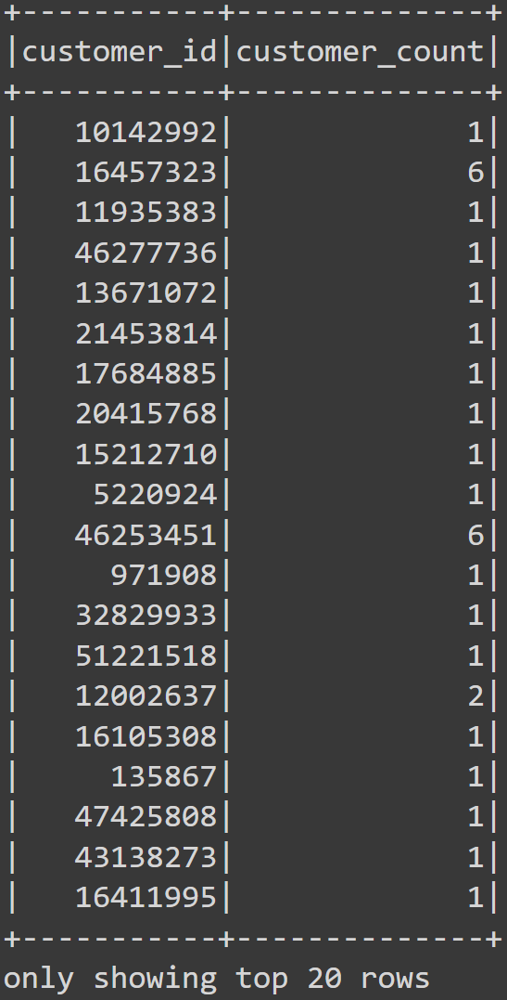|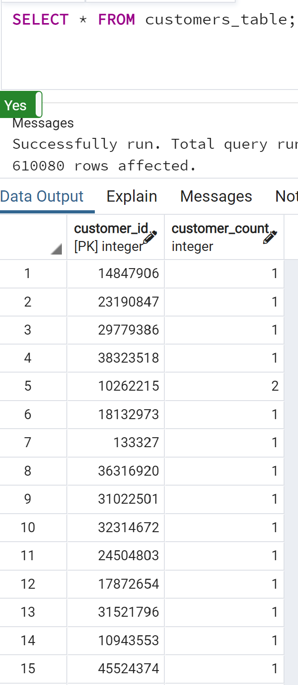|
|products_df / products_table|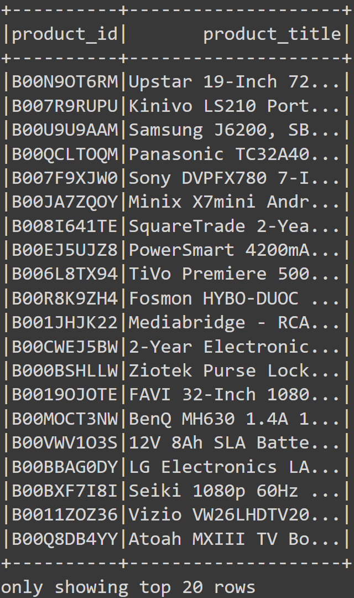|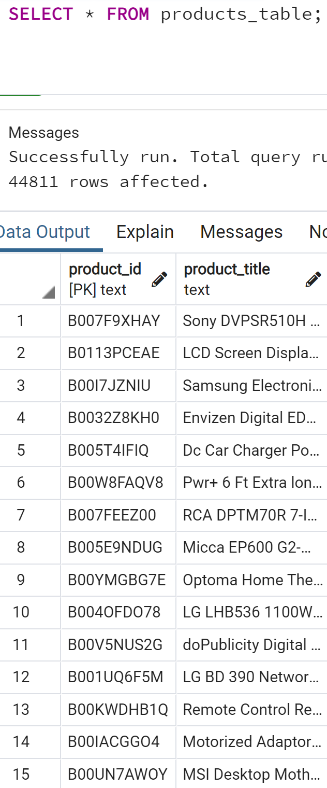|
|review_id_df / review_id_table|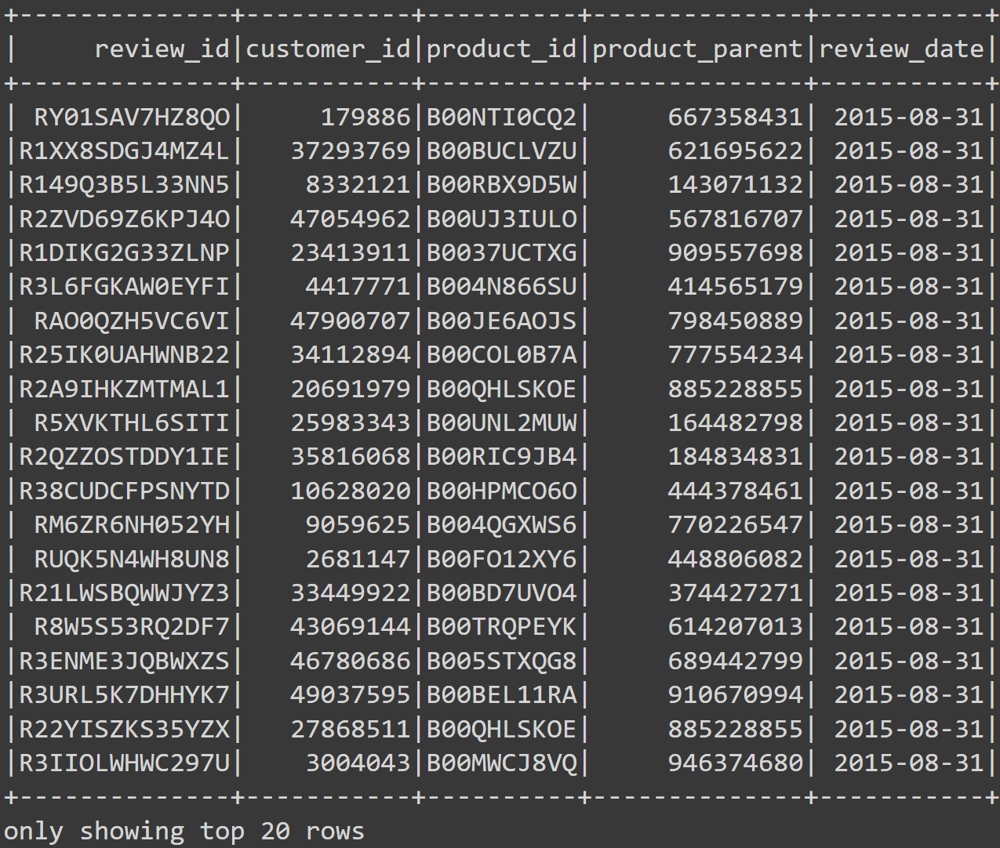|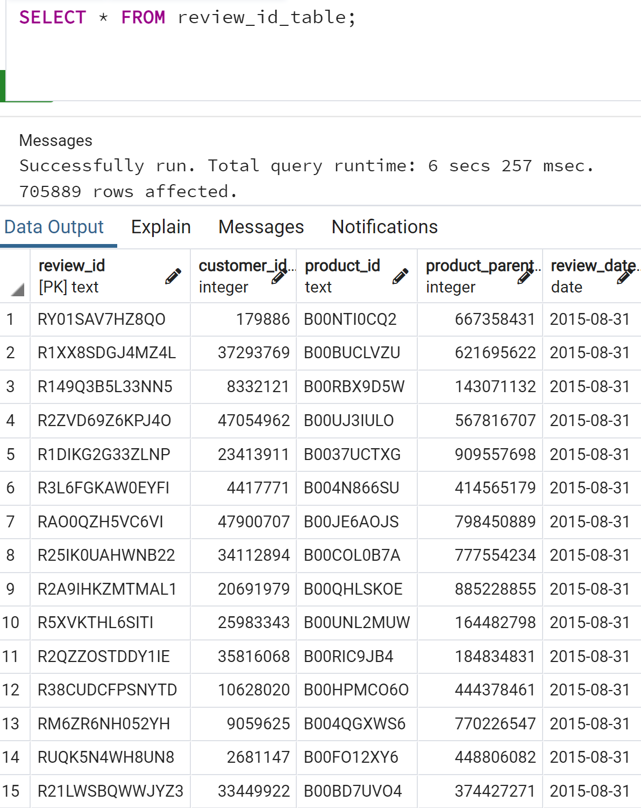|
|vine_df / vine_table|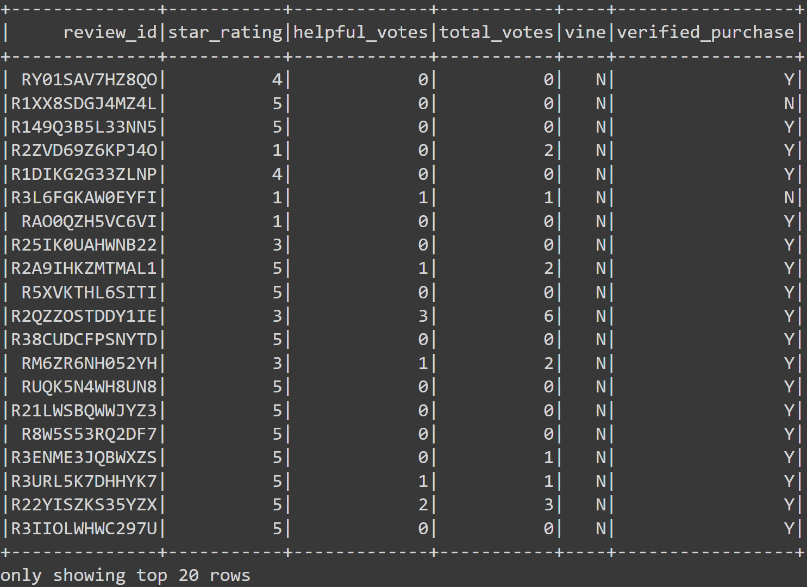|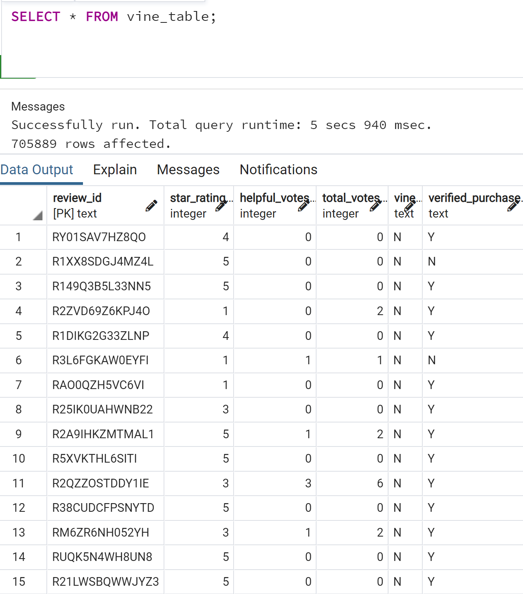|

### *Addressing Questions*
- Text (listed version) 
As described in later in this review,Note (3) the overall reviews in the dataset were filtered to consider select reviews (those with 20 or more votes, with 50% or more "helpful" votes) for this analysis; totals for these select reviews are presented here for consideration. {The overall review number totals are presented below as well — after the select values — for comparison.}
 - Total Number of Reviews
   > Of a total of  24,301 "helpful" reviews, 261 were Vine (paid) reviews, 24,040 unpaid. 
   > Of a total of 705,889 overall reviews (regardless of how helpful), 2,106 were Vine reviews and 703,783 were unpaid.
 - Five-Star Total Number (and Percentage) of Reviews
   > Of the 261 helpful Vine reviews, 106 (40.61%) were 5 stars. 
   > Of the 24,040 helpful unpaid reviews, 10,899 (45.34%) were 5 stars.

- Table (summary version - printed from Jupyter notebook)
  - [ Double-filtered "helpful" reviews ] : Note (3) 
  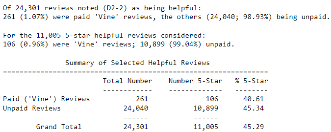
  
  - [ Overall dataset ] : 
  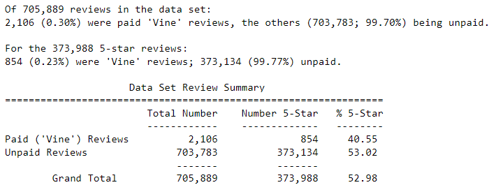

## Section III: Summary
After considering the outcomes of 5-star percentages for paid (Vine) and unpaid reviews, this analysis presents the conclusion that there *does not* exist a positivity bias for reviews in the Vine program. This conclusion is based on the finding that the five-star review percentage was lower for reviews of members in the Vine program versus the percentage for unpaid reviews.

An additional analysis that could be performed to support this conclusion would be to determine the average (mean, median - and perhaps mode) values for star-rating of the Vine versus unpaid reviews, with an eye towards review skew.

#### Notes:
(1) [ Columns in each category dataset ] : 
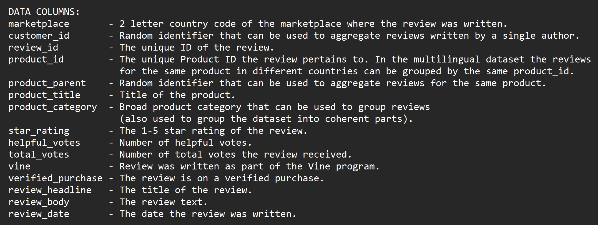 

(2) [ Data columns in Vine analysis ] : 
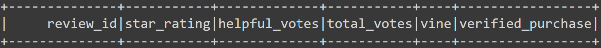 

(3) As noted in the Module 16 Challenge material, the rows considered in the Vine analysis table are only those where the `total_votes` column value "is equal to or greater than 20 to pick reviews that are more likely to be helpful and to avoid having division by zero errors later on." As well, that table is further filtered to consider only rows where the percentage ratio "number of `helpful_votes` divided by `total_votes` is equal to or greater than 50%." Then the values resulting from those two filters are separated into "Vine" (paid) versus unpaid reviews for consideration in the analysis (see images accompanying the analysis results above for summary value details). 

(4) For steps in the first deliverable — this after all being a module for "Big Data" — with a Google Colab Notebook, the selected dataset is uploaded and extracted directly into the notebook with PySpark code (with parsing as aided by class TA R. Kulkarni), transformed and written to a local PostgreSQL database (four tables) in PGAdmin 4. This also allows for becoming more familiar with the dataset components before analysis.
